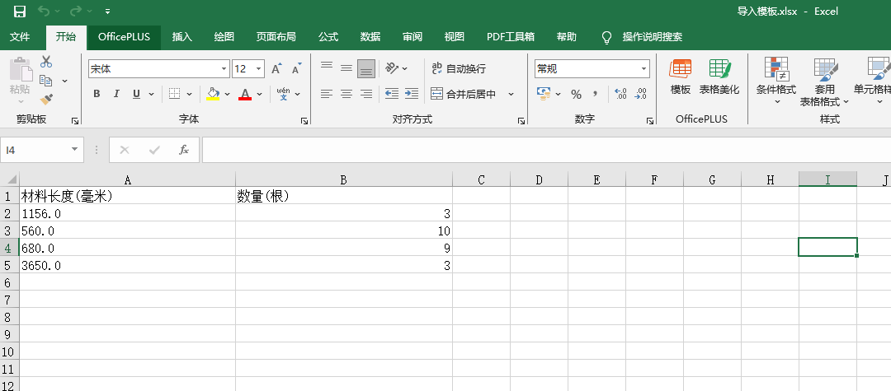

# 材料长度与消耗计算

介绍：

导入某种材料的多个需要的长度，自动计算出需要多少根某种材料，可设置整根误差和切割损耗。

1、在导入模板中，按已有数据格式，填写需要长度和数量

2、在页面中设置材料名称、材料长度、切割损耗、预留误差。点击导入，选择自己修改后的导入模板文件

3、查看计算出的消耗

## ⚠️ 仓库说明
本项目**主仓库位于 Gitee**，GitHub 为自动单向同步的只读镜像。

1. 你可以自由 Fork GitHub 上的代码副本，但所有代码提交、Bug反馈、功能建议、Pull Request，请前往 Gitee 主仓库。
2. GitHub仓库所有文件由Gitee自动同步覆盖，任何在此处的手动修改都会丢失。

👉 Gitee主仓库地址：https://gitee.com/miaoaa66/material-length-and-consumption-calculation
